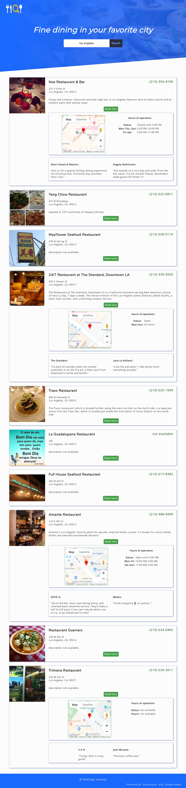
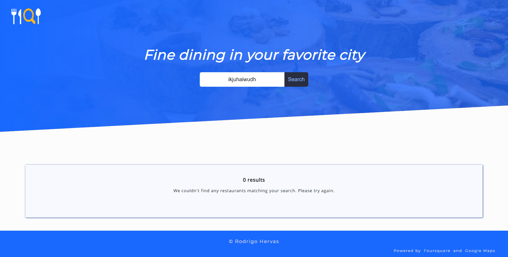

# DineOut

A restaurant search engine to find restaurants in a city. Users can search for restaurants in any city, and they will get a list of restaurants, with their location, reviews and more info. Powered by [Foursquare API](https://developer.foursquare.com/) and [Google Maps API](https://cloud.google.com/maps-platform/).

## Screenshots

**Landing Page:**

**Results Page:**

**Error Page:**

## Built With

* HTML5
* CSS3
* jQuery
* Javascript

* Foursquare API
* Google Maps API

## Features

* Search for a list of restaurants in a city
* Get restaurants
* Get restaurant details and map location
* Get restaurant reviews

## Live Demo

- [Live Demo](https://rodrigohervas.github.io/dineout/index)

## Author

**Rodrigo Hervas** - [LinkedIn](https://www.linkedin.com/in/rodrigo-hervas-54037013)